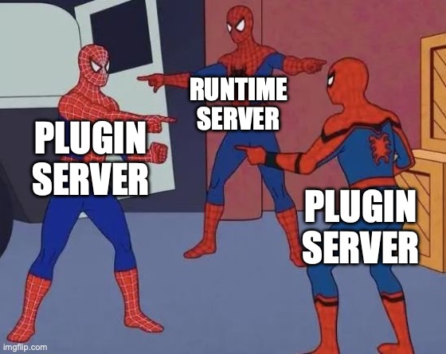

## Why do a plugin system?
It's cool! But seriously when do we actually need or want a plugin system and what does it solve? If we look around popular dev tooling for example, plugin systems are used at various places:
- IDE plugins: Eg., for VSCode a good plugin system is everything
- CLI plugins: The `kubetctl` and `docker` CLIs make heavy use of plugin system for extensability
- Webpack plugins: The webpack frontend buildsystem relies on plugins a lot. One could argue it's main purpose is providing a solid plugin system for a particular job.
- Browser plugins
- ...
  The main point is extensibility. Beyond that, things can vary quite a lot:
- Shipping form factor: Binary, JAR or custom format/spec?
- Technologies/languages: Single vs multi language, compiled vs scripting language
  Under the hood, these choices are related a lot to how the thing providing the plugin system is build. Does it already have an interpreter? Could DDLs be loaded?
  It's about understanding the constraints. VSCode is node based, Jetbrains IDEs are Java based etc. So either your plugins somewhat share your existing runtime environment (whatever that might be, node, JVM, browser) which usually seems easy (it's just calling another dynamically injected "function" provided by a 3rd party, isn't it?). Or you run it as another process, break out of your comfy runtime and drop all its constraints. Ie., it boils down to calling `exec` and coming up with clever IPC wrapped into an SDK.

## Aiming to be boring: Doing Go
In my situation, the project is in Go. Go is a very boring language (eg no OOP and all that) and that's exactly why it's perfect for building systems that aim to be reliable. Go as the "runtime" directly clears out many options. You could eg include running a python interpreter or a JVM, but it would very much defeat the intent of being boring as it would bring a whole lot of adventurous new problems.
In Go, to dynamically load 3rd party functionality, there are two options: DDLs or the famous `exec`.

